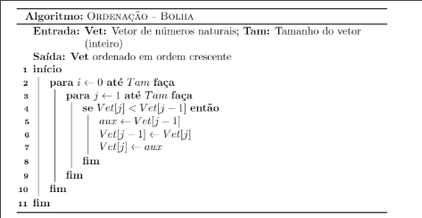

# Assunto

## Questao 1
Um dos algoritmos mais simples de ordenação é o chamado método BOLHA,
cujo algoritmo é apresentado na Figura 1.



Uma variação significativa do método bolha é o chamado Bolha Inteligente, que realiza
menos comparações que o Bolha.

Nessa atividade vocês deverão implementar os métodos Bolha e Bolha Inteligente em
C, seguindo as orientações abaixo:

- O projeto deve ser modularizado (main.c, bolha.c, bolha.h). Considere os
arquivos main.c e bolha.h enviados. Não é permitido fazer alterações neles.
Todas as funções presentes no bolha.h devem ser implementadas.
- Esse exercício é também para exercitarem o tratamento de dados em C e
revisitarem os conceitos de struct e TAD. Para tanto, considere o tipo de dado
composto definido pelo struct tReturn da Figura 2. Ele deve ser obrigatoriamente
implementado no arquivo bolha.c.

```C
struct tReturn
{
  int *vet;
  int tam;
  int erro;
};

```
